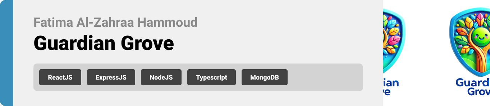
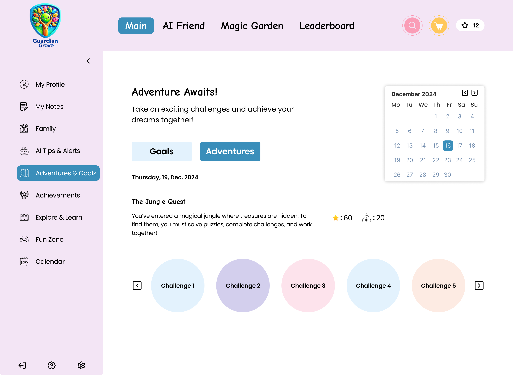
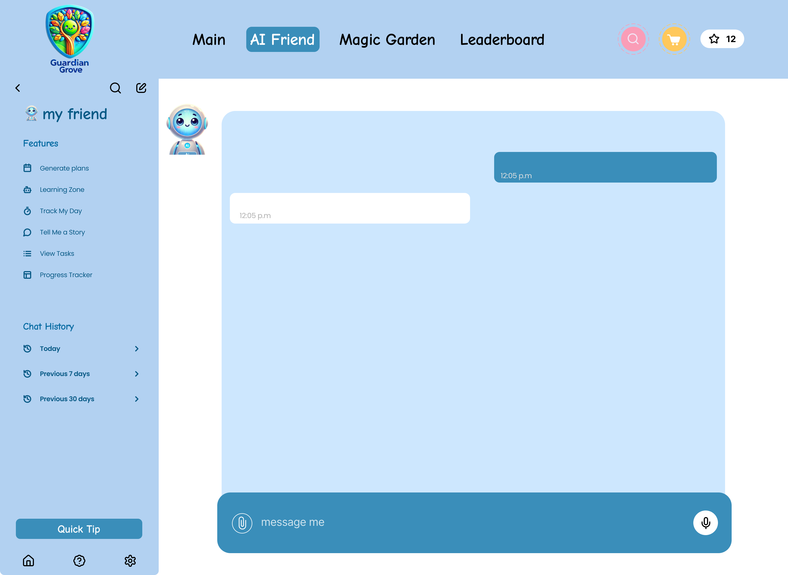

<br><br>

<!-- project philosophy -->


> Guardian Grove is a family-focused website designed to strengthen connections between family members through technology. In a world where technology often creates distance, we believe it can also bring families closer together when used intentionally.
>
>Our philosophy is rooted in trust, communication, and growth. By offering interactive features and AI-driven insights, Guardian Grove empowers parents to guide their child's development while fostering meaningful engagement and well-being. Technology, when designed with empathy, should enrich family relationships, not diminish them.

### User Stories

#### User
---
- As a user, I want to communicate with my AI friend for guidance, tasks, updates, learn, and generate plans.

- As a user, I want to monitor my progress and achievements while earning rewards to stay motivated and engaged.

- As a user, I want to receive personalized tasks and goals that support my growth and development.

- As a user, I want to participate in family activities, events, and adventures to bond with my family, compete with other families, and shine on the leaderboard.

- As a user, I want to preserve and share memories in a family journal to cherish special moments.

#### Parent
---
- As a parent, I want personalized growth plans and insights for my child to support their learning and development.

- As a parent, I want to monitor and track my child’s activities to ensure their safety and growth.

- As a parent, I want the AI to suggest bonding activities for me and my child to enhance our relationship.

- As a parent, I want to be notified of my child’s mood, location, inappropriate sounds, and progress to stay informed and offer support.

#### Child
---
- As a child, I want a space to express creativity (drawing, storytelling) and share it with my family.

#### Admin
---
- As an admin, I want to manage and monitor user accounts to ensure smooth operation.

- As an admin, I want to review analytics and user feedback to enhance platform performance.

- As an admin, I want to add and update store items to keep the virtual store fresh and engaging for users.

- As an admin, I want to create and manage achievement milestones, badges, and rewards to encourage users to stay engaged and strive for goals.

<br><br>
<!-- Tech stack -->


###  Guardian Grove is built using the following technologies:

- This project is developed using the [React](https://react.dev/) and [TypeScript](https://www.typescriptlang.org/) frameworks. React enables a dynamic and responsive user interface, while TypeScript ensures strong typing for more robust and maintainable code.

- For state management, the app leverages [Redux Toolkit](https://redux-toolkit.js.org/), streamlining global state management and making complex state interactions easier to handle.
- User authentication and secure backend interactions are implemented using [Express.js](https://expressjs.com/) and [Node.js](https://nodejs.org/en), all written in TypeScript. This ensures a fast, lightweight, and type-safe API for handling user data and custom AI interactions.
- The app’s AI assistant is powered by [OpenAI's API](https://platform.openai.com/docs), enabling intelligent, context-aware conversations and personalized goal-setting for children and parents.
- For database and persistent storage, [MongoDB](https://www.mongodb.com/) is used to manage data efficiently and reliably.
- Image, videos, audios uploads are handled through [Cloudinary](https://cloudinary.com/), allowing seamless media management and transformation.
- The app uses ["Comic Neue"](https://fonts.google.com/specimen/Comic+Neue) as its primary font, giving the design a friendly and approachable feel, while aligning with child-friendly aesthetics.
- Styling is achieved using [Tailwind CSS](https://tailwindcss.com/) and [Shadcn](https://ui.shadcn.com/) for efficient, modern, and responsive design


<br><br>
<!-- UI UX -->


> We designed Guardian Grove using wireframes and mockups, iterating on the design until we reached the ideal layout for easy navigation and a seamless user experience.

- Project Figma design [figma](https://www.figma.com/design/zX8v8ytWFBT3lOHK06YwyS/Final-Project-Ui-Ux?node-id=0-1&t=SiCWM1WktrHfQWUm-1)


### Mockups
| Login screen  | Adventures Screen | AIFriend Screen |
| ---| ---| ---|
|  |  |  |

<br><br>

<!-- Database Design -->


### Architecting Data Excellence: Innovative Database Design Strategies:

#### Models
---
<div style="display: flex;">
    
    
</div>

<div style="display: flex;">
    
    
</div>

<div style="display: flex; justify-content: space-between;">
    
    
</div>

#### Embedded Schemas
---
<div style="display: flex;">
    
    
</div>

<div style="display: flex; justify-content: space-between;">
    
    
</div>

<br><br>


<!-- Implementation -->


### User Screens
| Login screen  | Register screen | 
| ---| ---|
|  |  |

| Landing screen | Loading screen |
| ---| ---|
|  |  |

| Home screen  | Menu Screen | Order Screen | Checkout Screen |
|  |  |  |  |

### Admin Screens (Web)
| Login screen  | Register screen |  Landing screen |
| ---| ---| ---|
|  |  |  |
| Home screen  | Menu Screen | Order Screen |
|  |  |  |

<br><br>


<!-- Prompt Engineering -->


###  Mastering AI Interaction: Unveiling the Power of Prompt Engineering:


In **Guardian Grove**, we leverage advanced **prompt engineering** to enhance interactions with our AI-powered chatbot. Powered by **OpenAI's GPT-4**, the chatbot is designed to provide personalized support for both parents and children. Through careful design of input prompts, we ensure the AI understands and responds accurately to the needs of each family member—whether it's offering parenting tips, helping children with age-appropriate tasks, or tracking progress on family goals.

By integrating real-time data, the AI tailors its responses to keep families engaged, motivated, and supported in their journey toward shared goals and achievements.

### Key Features

- **Personalized AI Conversations**: The AI adapts its responses to fit the age, interests, and needs of each family member. Parents receive parenting tips and suggestions, while children enjoy fun tasks and rewards that encourage growth.
  
- **Dynamic Goal Setting**: The AI generates collaborative, AI-driven tasks, goals, and adventures for all families and members to work on. By completing tasks, families earn rewards that help keep everyone motivated and engaged.

- **Real-Time Monitoring and Alerts**: The AI tracks family activities, moods, and locations. It sends alerts to parents if anything unusual happens, ensuring safety while also offering guidance and support.

Through **prompt engineering**, **Guardian Grove** ensures that the AI is always in tune with your family's unique needs, offering insightful, personalized responses that encourage family bonding, growth, and security.

*An illustration showcasing how AI creates exciting adventures and challenges to foster growth and engagement.*


<br><br>

<!-- AWS Deployment -->


###  Efficient AI Deployment: Unleashing the Potential with AWS Integration:

**Our AI-powered application harnesses AWS to deliver reliable and scalable solutions. Here's what makes our APIs special:**

- Most of our endpoints like checkAnswer and generateGoals respond quickly (1.41-2.2s), while generateTrackMyDay takes around 11.51s for more thoughtful responses. Our star player, generateAdventures, takes about 11.96s but for good reason - it creates 7 unique daily challenges that keep users engaged throughout the week!

- We've optimized our AWS setup to handle these varying response times efficiently, ensuring a smooth experience whether you're checking a quick answer or getting your weekly adventure pack.

| generateGoals API  | checkAnswer API | 
| ---| ---|
|  |  |

| generateAdventures screen | generateTrackMyDay API |
| ---| ---|
|  |  |

<!-- Unit Testing 


###  Precision in Development: Harnessing the Power of Unit Testing:

- This project employs rigorous unit testing methodologies to ensure the reliability and accuracy of code components. By systematically evaluating individual units of the software, we guarantee a robust foundation, identifying and addressing potential issues early in the development process.-->

<br><br>


<!-- How to Run -->


> To set up Guardian Grove locally, follow these steps:

### Prerequisites

Before you begin, ensure the following are installed and configured on your system:

- **Node.js** (v16+): JavaScript runtime for the app.  
- **npm** or **yarn**: Dependency managers (included with Node.js).  
- **Vite**: Fast build tool for the frontend project.  
- **MongoDB**: NoSQL database (local or [Atlas](https://www.mongodb.com/atlas)).  
- **Cloudinary API Key**: For image uploads ([Sign up](https://cloudinary.com/)).  
- **ElevenLabs API Key**: For voice features ([Sign up](https://elevenlabs.io/)).  
- **OpenAI API Key**: For AI content ([Sign up](https://platform.openai.com/)).  

> Make sure all API keys are set in the environment variables or configuration files as required by the application.


### Steps to Run the Project

#### 1. **Clone the Repository with Submodules** 

   ```bash
   git clone --recurse-submodules https://github.com/fatima-alzahraa-hammoud/guardian-grove
   cd <guardian-grove>
   ```
   
#### 2. **Navigate to Submodules**

#### for frontend:

   ```bash
   cd guardian-grove-frontend
   npm install
   ```
#### for backend:

   ```bash
   cd guardian-grove-backend
   npm install
   ```

#### 3. **Set Up Environment Variables**

#### Create **.env** files in backend:

- MONGO_URI= < Your MongoDB connection string >
- CLOUDINARY_KEY= < Your Cloudinary API key >
- CLOUDINARY_API_SECRET= < Your Cloudinary API secret >
- ELEVENLABS_KEY= < Your ElevenLabs API key >
- OPENAI_KEY= < Your OpenAI API key >
- JWT_SECRET= < Your secret key for JWT authentication >

#### 3. **Run the Project**
>Start both the frontend and backend services:

#### Frontend:

   ```bash
   cd guardian-grove-frontend
   npm run dev
   ```
#### Backend:

   ```bash
   cd guardian-grove-backend
   npm start
   ```
<br>

> 💡 Tip: Use tools like [Postman](https://www.postman.com/) to test API endpoints or [Vite](https://vite.dev/) for faster frontend builds.

### **Then, Welcome to Guardian Grove😊!**
**Now, You should be able to run Guardian Grove locally and explore its features.**
